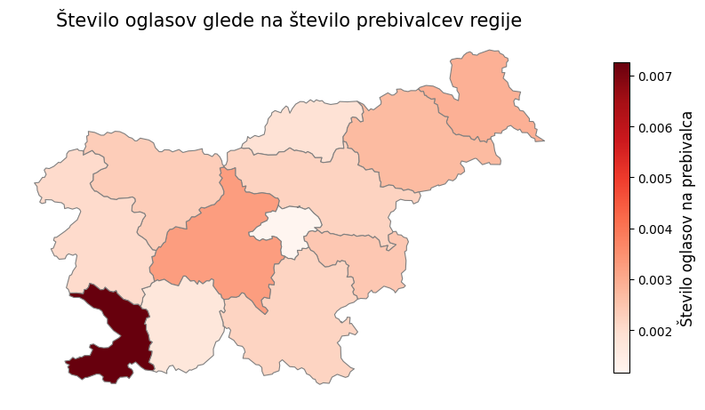

# Ko kvadratni metri spregovorijo – ali so slovenske nepremičnine "kuhane"?​

## Opis problema

V seminarski nalogi se osredetočamo na pridobivanje znanj z analizo nepremičninskih oglasov, ki so objavljeni v aprilu 2025. Naša glavna vprašanja oz. cilji so:
- Napovedovanje cene v odvisnosti od podanih atributov.
- Ali se nakup novogradenj bolj splača od nakupa starejših nepremičnin?​
- Katere nepremičninske agencije ponujajo najboljše ponudbe?​
- Kako se nepremičninski trg sklada s prebivalstvom posamezne regije?

Do vmesnega poročila smo zbrali vse ustrezne podatke in jih predstavili z raznimi vizualizacijami. V glavnem smo se osredotočili na oglase za prodajo hiš in stanovanj.

## Zajemanje podatkov

Podatke smo zajemali iz spletnih strani [nepremicnine.net](), [mojikvadrati.com]() in [bolha.com]().

Za obhod raznih zaščit strani pred roboti smo uporabili knjižnico `hrequests`. Podatke smo dobili iz HTML-ja strani, saj nobena stran nima ustreznega odprtega vmesnika. Za branje podatkov iz HTML strukture smo uporabili knjižnico `BeautifulSoup`.

Vnosom iz zbirke strani `mojikvadrati.com` smo dodali še podatke o koordinatah. Za to smo uporabili knjižnico `geopy`. Koordinate smo dobili iz naslovov oglasov, vendar zaradi narave podatkov včasih koordinate niso točne.

Skupaj smo zbrali nad 70.000 oglasov, ki smo jih zapisali v `csv` datoteke.

## Vizualizacije

Za branje podatkov v Pythonu smo uporabili `pandas` knjižnico, grafe pa smo risali z `matplotlib` in `seaborn`. Za risanje podatkov na zemljevidu smo uporabili `cartopy` in `geopandas` knjižnici.

### Splošni pogled na cene

Za začetek smo pogledali, kako se cene odražajo glede na lokacijo. Spodaj je prikazan zemljevid, kjer so narisane vse cene hiš in stanovanj.

Vidimo, da se pojavijo območja, kjer je veliko dragih nepremičnin, kot sta Ljubljana in Obala. Nekaj dragih nepremičnin se pojavi še v krajih, od koder se ljudje pogosto vozijo v Ljubljano, kot so Kranj, Domžale in Grosuplje. Drage nepremičnine se pojavijo še v Jesenicah, Kranjski gori in Novi Gorici. Zanimivo je, da je v okolici Maribora in v Savinjski regiji na voljo veliko nepremičnin, ki pa so relativno poceni.

### Povezava starosti z izbranimi atributi

Da smo preverili, ali starost gradnje vpliva na ceno, smo narisali razsevni diagram in preverili Pearsonov koeficient.

Vidimo, da ima starost gradnje nizko stopnjo korelacije s ceno. To nam pove tudi nizek Pearsonov koeficient (0,17). Stare nepremičnine so namreč pogosto adaptirane, zaradi česar jim vrednost ne pada. V povprečju je namreč nepremičnina adaptirana po 75 letih. Res pa je, da je povprečna cena na kvadratni meter nepremičnin zgrajenih po letu 2020 kar za 26% višja od povprečne cene ostalih nepremičnin (2970 proti 3740 EUR/m2).

Kot pričakovano, so novogradnje poleg višje cene tudi bolj energetsko učinkovite. Iz tega sledi, da je tudi med ceno in energetsko učinkovitostjo korelacija, čeprav dokaj nizke stopnje.

Za novogradnje bomo torej odšteli več denarja, ampak običajno dobimo bistveno boljši produkt.

Poglejmo si še, kje se nahaja največ novogradenj:

Vidimo, da je ta mapa zelo podobna mapi dragih nepremičnin. Večina novogradenj je v večjih slovenskih mestih, prav tako pa jih je kar nekaj blizu meje na hrvaški obali.

### Nepremičninske agencije

Pogledali smo, kolikšen delež nepremičninskega trga zaseda posamezna agencija in katera ima v povprečju najboljše ponudbe.

Vidimo, da velike franšize, kot so CENTURY 21, RE/MAX in KW nimajo ogromnega tržnega deleža. Ta je namreč dokaj enakomerno razporejen med stotine manjših agencij.

Samo s pogledom na cene je težko določiti, katera agencija ima najboljše ponudbe, saj vsaka agencija prodaja velik spekter vrst nepremičnin. Njena povprečna cena se tako prilagodi vrsti nepremičnine, ki jo najpogosteje prodajajo (luksuzne vile ali zanemarjene hiše). Vidimo, da obstajajo agencije, ki se osredotočajo na nepremičnine z nizko vrednostjo (RENES, Agenti, LAND), nihče pa se ne osredotoča samo na luksuzne nepremičnine, čeprav se Ljubljana nepremičnine in INFINIS temu približata.

V prihodnosti bomo z napovednim modelom za cene lahko ocenili, kako poštene so cene posameznih agencij in kako močno cene novogradenj odstopajo od pričakovanj.

### Cena v odvnisnosti od demografskih atributov

Na prvem zemljevidu lahko opazujemo regije, ki imajo veliko ponudbo nepremičnin na prebivalca. To lahko namiguje k temu, da ima tam manj ljudi stalne naslove, torej gre večinoma za vikende. Tu izstopa Obala, kar ni presenetljivo. Vidimo tudi, da je v Zasavski regiji premalo ponudbe glede na število prebivalcev.

Na naslednjem zemljevidu pa vidimo razmerje med povprečno ceno nepremičnin in povprečno neto plačo prebivalcev te regije. To nam pove, koliko mesecev bi prebivalec neke regije moral delati, da bi si lahko privoščil povprečno stanovanje/hišo, brez da upoštevamo druge mesečne stroške. Na tem zemljevidu prevladujeta Osrednjeslovenska in Obalno-kraška regija. Najbolj ugodne regije pa so Zasavksa, Primorsko-notranjska in Pomurska regija.

Kot demografski atribut smo pogledali še, če je na voljo več nepremičnin v regijah, kjer je več ločitev. Novo ločeni ljudje namreč običajno rabijo tudi novo nepremičnino.

V Obalno-kraški ločitve najverjetneje nimajo vpliva na število nepremičnin, ker je regija bolj turistično nagnjena. Graf se bistveno ne razlikuje od razmerja med številom oglasov in številom prebivalcev, torej iz njega lahko potegnemo enake ugotovitve.

Iz zgornjih grafov sklepamo, da je po večini prodaja nepremičnin v skladu s povpraševanjem. Kot regijo s preveč prodaje smo označili Obalno-kraško. V Osrednjeslovnski in Gorenjski regiji vidimo, da je oglasov sicer dovolj, ampak so cenovno nedostopni. Prostor za razširitev prodaje smo zaznali v Zasavki in Primorsko-notranjski regiji, kjer je zaenkrat relativno malo oglasov, ki so precej poceni. Tu pa se je treba spomniti, da ti dve regiji ne vključujeta večjih gospodarskih središč, kar lahko odvrne kupce.

### Analiza iz besedila

### Analiza iz slik

### Regresor

### Interaktivni zemljevid

