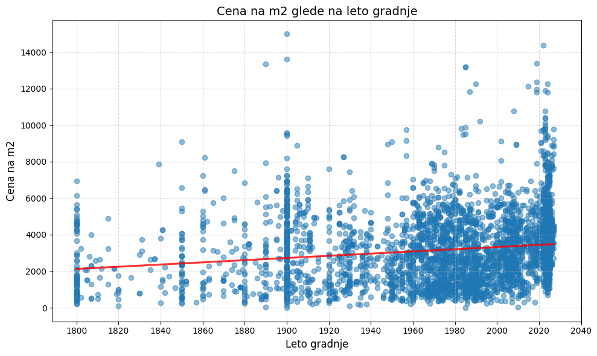
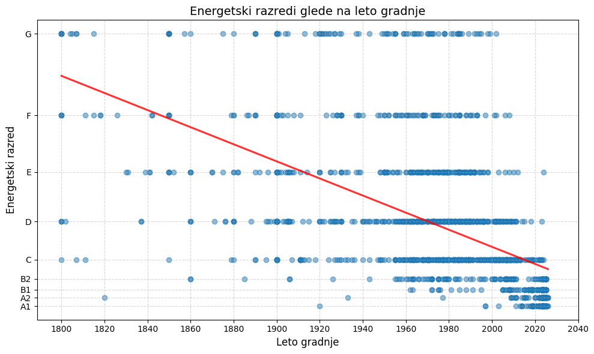
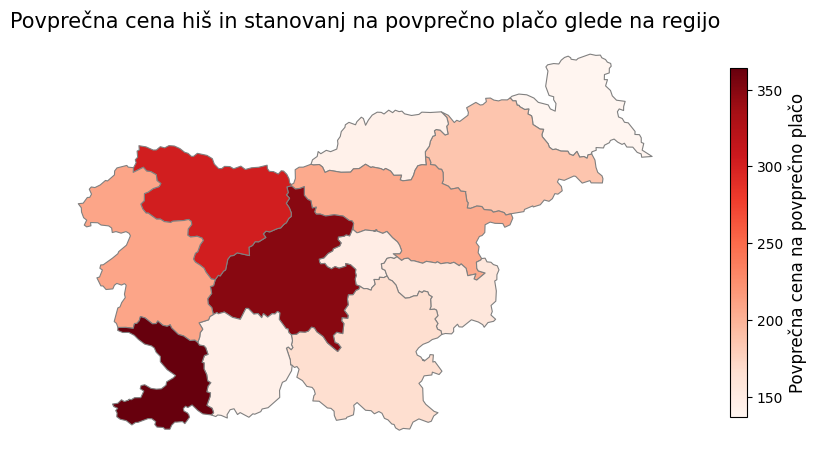
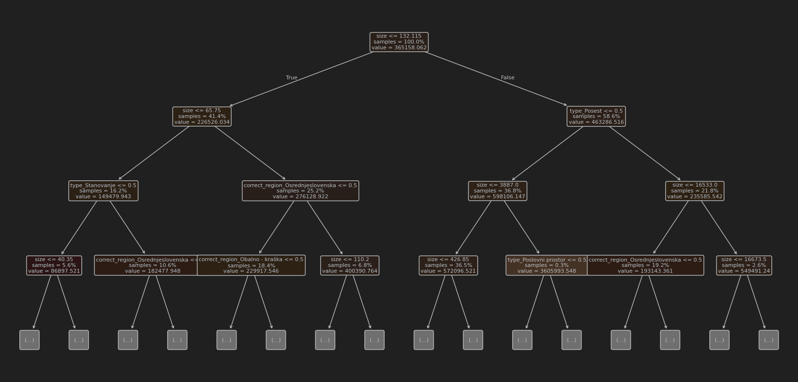

# Ko kvadratni metri spregovorijo – ali so slovenske nepremičnine "kuhane"?

Streamlit aplikacija je objavljena na [https://pr251-nepremicnine1.streamlit.app/](https://pr251-nepremicnine1.streamlit.app/).

## Opis problema

V seminarski nalogi se osredetočamo na pridobivanje znanj z analizo nepremičninskih oglasov, ki so objavljeni v aprilu 2025. Naša glavna vprašanja oz. cilji so:
- Ali se nakup novogradenj bolj splača od nakupa starejših nepremičnin?
- Katere nepremičninske agencije ponujajo najboljše ponudbe?
- Kako se nepremičninski trg sklada s prebivalstvom posamezne regije?
- Kateri atributi najbolj vplivajo na ceno nepremičnin?
- Ustvarjanje napovednih modelov cene iz atributov, slik in opisov.

V glavnem smo se osredotočili na oglase za prodajo hiš in stanovanj.

## Zajemanje podatkov

Podatke smo zajemali iz spletnih strani [nepremicnine.net](https://nepremicnine.net), [mojikvadrati.com](https://mojikvadrati.com) in [bolha.com](https://bolha.com).
Skupaj smo zbrali nad 70.000 oglasov, ki smo jih zapisali v `csv` datoteke. Podrobnejši postopek zajemanja je predstavljen v datoteki [dodatek.md](dodatek.md).

## Vizualizacije

### Splošni pogled na cene

Za začetek smo pogledali, kako se cene odražajo glede na lokacijo. Spodaj je prikazan zemljevid, kjer so narisane vse cene hiš in stanovanj.


Vidimo, da se pojavijo območja, kjer je veliko dragih nepremičnin, kot sta Ljubljana in Obala. Nekaj dragih nepremičnin se pojavi še v krajih, od koder se ljudje pogosto vozijo v Ljubljano, kot so Kranj, Domžale in Grosuplje. Drage nepremičnine se pojavijo še v Jesenicah, Kranjski gori in Novi Gorici. Zanimivo je, da je v okolici Maribora in v Savinjski regiji na voljo veliko nepremičnin, ki pa so relativno poceni.

### Vpliv starosti na ostale značilnosti nepremičnine

Da smo preverili, ali starost gradnje vpliva na ceno, smo narisali razsevni diagram in preverili Pearsonov koeficient.



Vidimo, da ima starost gradnje nizko stopnjo korelacije s ceno. To nam pove tudi nizek Pearsonov koeficient (0,17). Stare nepremičnine so namreč pogosto adaptirane, zaradi česar jim vrednost ne pada. V povprečju je namreč nepremičnina adaptirana po 75 letih. Res pa je, da je povprečna cena na kvadratni meter nepremičnin zgrajenih po letu 2020 kar za 26% višja od povprečne cene ostalih nepremičnin (2970 proti 3740 EUR/m2).

Kot pričakovano, so novogradnje poleg višje cene tudi bolj energetsko učinkovite. Iz tega sledi, da je tudi med ceno in energetsko učinkovitostjo korelacija, čeprav dokaj nizke stopnje.



Za novogradnje bomo torej odšteli več denarja, ampak običajno dobimo boljši produkt. Kljub temu trdimo, da se nakup nepremičnin, ki so starejše okoli 5 let bolj splača od nakupa novogradenj.

Poglejmo si še, kje se nahaja največ novogradenj:


Vidimo, da je ta mapa zelo podobna mapi dragih nepremičnin. Večina novogradenj je v večjih slovenskih mestih, prav tako pa jih je kar nekaj blizu meje na hrvaški obali.

### Nepremičninske agencije

Pogledali smo, kolikšen delež nepremičninskega trga zaseda posamezna agencija in katera ima v povprečju najboljše ponudbe.


Vidimo, da velike franšize, kot so CENTURY 21, RE/MAX in KW nimajo ogromnega tržnega deleža. Ta je namreč dokaj enakomerno razporejen med stotine manjših agencij.

Samo s pogledom na cene je težko določiti, katera agencija ima najboljše ponudbe, saj vsaka agencija prodaja velik spekter vrst nepremičnin. Njena povprečna cena se tako prilagodi vrsti nepremičnine, ki jo najpogosteje prodajajo (luksuzne vile ali zanemarjene hiše). Trdimo torej, da ne moremo določiti ene najboljše agencije, saj se vse prilagodijo razmeram na trgu.

Glej [dodatek.md](dodatek.md).


### Cena v odvnisnosti od demografskih atributov




Na prvem zemljevidu lahko opazujemo regije, ki imajo veliko ponudbo nepremičnin na prebivalca. To lahko namiguje k temu, da ima tam manj ljudi stalne naslove, torej gre večinoma za vikende. Tu izstopa Obala, kar ni presenetljivo. Vidimo tudi, da je v Zasavski regiji premalo ponudbe glede na število prebivalcev.

Na naslednjem zemljevidu vidimo razmerje med povprečno ceno nepremičnin in povprečno neto plačo prebivalcev te regije. To nam pove, koliko mesecev bi prebivalec neke regije moral delati, da bi si lahko privoščil povprečno stanovanje/hišo, brez da upoštevamo druge mesečne stroške. Na tem zemljevidu prevladujeta Osrednjeslovenska in Obalno-kraška regija. Najbolj ugodne regije pa so Zasavksa, Primorsko-notranjska in Pomurska regija.

Iz zgornjih grafov sklepamo, da je po večini prodaja nepremičnin v skladu s povpraševanjem. Kot regijo s preveč prodaje smo označili Obalno-kraško. V Osrednjeslovnski in Gorenjski regiji vidimo, da je oglasov sicer dovolj, ampak so cenovno nedostopni. Prostor za razširitev prodaje smo zaznali v Zasavki in Primorsko-notranjski regiji, kjer je zaenkrat relativno malo oglasov, ki so precej poceni. Tu pa se je treba spomniti, da ti dve regiji ne vključujeta večjih gospodarskih središč, kar lahko odvrne kupce.

Glej [dodatek.md](dodatek.md).

### Pomembnost atributov

Pri napovedovanju cene z uporabo metode odločitvenih dreves je, če ocenjujemo glede na tip, regijo in površino nepremičnine (pri čemer na neštevilskih atributih uporabimo metodo one-hot encoding), najbolj pomemben atribut površina (pomembnost okoli 0,73), sledita pa mu tip nepremičnine in regija. Če pa napovedujemo ceno/m², torej le glede na tip in regijo, je najpomembnejši atribut, ali je nepremičnina tipa posest (pomembnost okoli 0,47), sledijo pa ostali tipi nepremičnin in regija. Na spodnjih slikah vidimo grafični prikaz pomembnosti atributov za absolutno in za relativno ceno.

Pomembnost atributov za absolutno ceno:



Pomembnost atributov za relativno ceno:


### Regresor

Uporabili smo več različnih regresijskih modelov za napovedovanje cene glede na površino, regijo in tip nepremičnine. Najboljše rezultate, glede na prečno preverjanje, sta dala GradientBoosting in RandomForestRegressor, pri katerem sta bili optimalni globini 5 in 6 (R² med 0,3 in 0,5). Modeli LinearRegression, Ridge in Lasso so nekoliko slabši z R² med 0 in 0,15, medtem ko R² modelov KNeighborsRegressor in MLPRegressor pogosto ne preseže 0.

Primer prečne validacije na testni množici velikosti 0,2:
```
R² na testnem setu (LinearRegression): 0.10430657870022642
R² na testnem setu (Ridge): 0.08497044209656046
R² na testnem setu (Lasso): 0.12098481134349481
R² na testnem setu (RandomForest5): 0.43190956529848945
R² na testnem setu (RandomForest6): 0.4549999146831979
R² na testnem setu (GradientBoosting): 0.46266591862521667
R² na testnem setu (KNN): -0.005953077114646987
R² na testnem setu (MLP): -0.44082198062659184
```

### Analiza iz opisa

Za učenje modela smo besedilne opise pretvoriti v vektorje z uporabo knjižnice `sentence_transformers` in modela `all-MiniLM-L6-v2`.
Linearni regresijski model (RandomForest, Ridge, Lasso, ...) nam niso vrnili dobrih rezultatov,
zato smo v drugem koraku uporabili jezikovni model BERT (`bert-base-multilingual-cased`), ki pa prav tako ni vrnil uporabnega modela.

Iz tega lahko opazimo, da so opisi neprimeren podatek za napovedovanje cen nepremičnin.

### Analiza iz slik

Večina oglasov ima podanih eno ali več slik nepremičnine. V naši podatkovni množici smo zbrali naslovne fotografije oglasov. Z njimi smo naučili konvolucijsko nevronsko mrežo za napoved cene na kvadratni meter iz podane slike. Za osnovni model smo vzeli ResNet50 mrežo z utežmi, določenimi iz podatkovne zbirke ImageNet-1k z ločljivostjo 224x224. Osnovnemu modelu smo za učenje odklenili zadnjih 20 plasti.

Pri učenju so veliko težav povzročile fotografije, ki slabo predstavijo nepremičnino npr., ko je namesto hiše slikan bližnji gozd. Take fotografije smo deloma počistili z ročnim pregledom. Za učenje modela nam je ostalo okoli 44.000 fotografij. Model smo testirali na 1.000 fotografijah oglasov, ki so bili objavljeni po prvotnem zbiranju oglasov.

V povprečju se model zmoti za 810 EUR/m2 oz. za 33%, kar je precej slabo. Veliko napako pripisujemo veliki količini prej opisanega šuma med slikami. Poleg tega so cene nepremičnin neenakomerno porazdeljene.

### Končni napovedni model

Za najbolj natančen model smo vzeli hibrid med modelom, ki napoveduje ceno iz slike, in med modelom, ki napoveduje ceno iz opisnih atributov. Vsak model je obtežen z 0,5. Z njim smo prišli do povprečne napake 28%. Model je najbolj točen pri primerih okoli povprečne cene (približno 3.000 EUR/m2), kar je razvidno tudi iz spodnjega grafa napak.


### Interaktivni zemljevid

V streamlitu smo implementirali zemljevid, ki prikazuje porazdelitev nepremičnin po Sloveniji. Z uporabo filtrov za ceno in leto gradnje lahko preverimo npr. kje se nahajajo najdražje ali najcenejše nepremičnine ter v katerih regijah je več novogradenj. Tako lahko enostavno primerjamo med različnimi območji in morda prepoznamo trende na trgu kot so območja z intenzivnejšo gradnjo.
