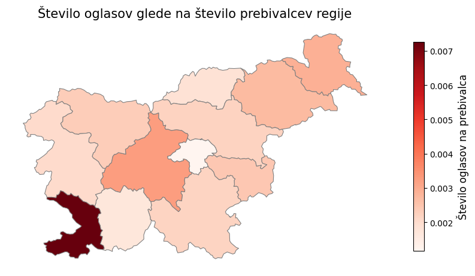
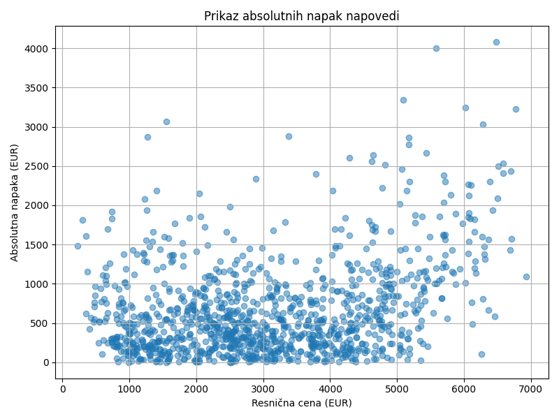

# Ko kvadratni metri spregovorijo – ali so slovenske nepremičnine "kuhane"?

Streamlit aplikacija je objavljena na [https://pr251-nepremicnine3.streamlit.app/](https://pr251-nepremicnine3.streamlit.app/).

## Opis problema

V seminarski nalogi se osredetočamo na pridobivanje znanj z analizo nepremičninskih oglasov, ki so objavljeni v aprilu 2025. Naša glavna vprašanja oz. cilji so:
- RQ1: Ali se nakup novogradenj bolj splača od nakupa starejših nepremičnin?
- RQ2: Katere nepremičninske agencije ponujajo najboljše ponudbe?
- RQ3: Kako se nepremičninski trg sklada s prebivalstvom posamezne regije? Kje je torej trg prenasičen in kje neizkoriščen?
- RQ4: Kateri atributi najbolj vplivajo na ceno nepremičnin?
- RQ5: Ustvarjanje napovednih modelov cene iz atributov, slik in opisov.

V glavnem smo se osredotočili na oglase za prodajo hiš in stanovanj.

## Zajemanje podatkov

Podatke smo zajemali iz spletnih strani [nepremicnine.net](https://nepremicnine.net), [mojikvadrati.com](https://mojikvadrati.com) in [bolha.com](https://bolha.com).
Skupaj smo zbrali več kot 70.000 oglasov, ki smo jih zapisali v `csv` datoteke. Podrobnejši postopek zajemanja je predstavljen v datoteki [dodatek.md](dodatek.md).

## Vizualizacije

Glej [dodatek.md](dodatek.md).

### Vpliv starosti na ostale značilnosti nepremičnine

Da smo preverili, ali starost gradnje vpliva na ceno, smo narisali razsevni diagram in preverili Pearsonov koeficient.

Vidimo, da ima starost gradnje nizko stopnjo korelacije s ceno. Stare nepremičnine so namreč pogosto adaptirane (v povprečju po 75 letih), zaradi česar jim vrednost ne pada. Res pa je, da je povprečna cena na kvadratni meter nepremičnin, zgrajenih po letu 2020, kar za 26% višja od povprečne cene ostalih nepremičnin (2970 proti 3740 EUR/m²).

Kot pričakovano, so novogradnje poleg višje cene tudi bolj energetsko učinkovite, kar je vidno na spodnjem grafu.

Za novogradnje bomo torej odšteli več denarja, ampak običajno dobimo boljši produkt. Kljub temu trdimo, da se nakup nepremičnin, ki so stare okoli 5 let, bolj splača od nakupa novogradenj (RQ1), saj iz grafov in izračuna vidimo, da se pri tej starosti razpon cene močno spusti, medtem ko se kvaliteta nepremičnine minimalno zmanjša.

### Nepremičninske agencije

Pogledali smo, katera agencija ima v povprečju najboljše ponudbe. Spodnji graf prikazuje relativne cene za največje agencije. Tu se moramo zavedati, da te agencije nimajo ogromnega tržnega deleža, saj je ta dokaj enakomerno razporejen med stotine manjših agencij.

Samo s pogledom na cene je težko določiti, katera agencija ima najboljše ponudbe, saj vsaka agencija prodaja velik spekter vrst nepremičnin. Njena povprečna cena se tako prilagodi vrsti nepremičnine, ki jo najpogosteje prodaja (luksuzne vile ali zanemarjene hiše). Trdimo torej, da ne moremo določiti najboljših agencij, saj se vse prilagodijo razmeram na trgu (RQ2).

### Cena v odvnisnosti od demografskih atributov

Na prvem zemljevidu lahko opazujemo regije, ki imajo veliko ponudbo nepremičnin na prebivalca. Na naslednjem zemljevidu pa vidimo razmerje med povprečno ceno nepremičnin in povprečno neto plačo prebivalcev te regije. Na tem zemljevidu prevladujeta Osrednjeslovenska in Obalno-kraška regija. Najbolj ugodne regije pa so Zasavksa, Primorsko-notranjska in Pomurska regija.

Iz zgornjih grafov smo kot regijo s preveč prodaje označili Obalno-kraško. V Osrednjeslovenski in Gorenjski regiji vidimo, da je oglasov sicer dovolj, ampak so cenovno nedostopni. Prostor za razširitev prodaje smo zaznali v Zasavski in Primorsko-notranjski regiji, kjer je zaenkrat relativno malo oglasov, ki so precej poceni. Tu pa se je treba spomniti, da ti dve regiji ne vključujeta večjih gospodarskih središč, kar lahko odvrne kupce. Okolica Maribora in Celja (Podravska in Savinjska regija) na zemljevidih izgledata kot najbolj primerna prostora za iskanje nepremičnine, saj vsebujeta relativno veliko oglasov po relativno nizki ceni, hkrati pa sta to večji mesti (RQ3).

V [dodatek.md](dodatek.md) lahko vidimo bolj točne lokacije nepremičnin na zemljevidu.

## Pomembnost atributov

Pri napovedovanju cene z uporabo metode odločitvenih dreves je, če ocenjujemo glede na tip, regijo in površino nepremičnine, najbolj pomemben atribut površina, sledita pa mu tip nepremičnine in regija (RQ4). Če pa napovedujemo ceno/m², torej le glede na tip in regijo, je najpomembnejši atribut, ali je nepremičnina tipa posest, sledijo pa ostali tipi nepremičnin in regije. Izmed regij je v obeh primerih najpomembnejša Osrednjeslovenska, nato pa Obalno-kraška. Najpomembnejši tip nepremičnine je posest, sledita pa stanovanje in hiša. Na spodnjih slikah vidimo grafični prikaz pomembnosti atributov za absolutno in za relativno ceno.

V [dodatek.md](dodatek.md) je pomembnost atributov prikazana še vizualno.

## Napovedni model

### Napoved cene iz opisnih atributov

Uporabili smo več različnih regresijskih modelov za napovedovanje cene glede na površino, regijo in tip nepremičnine. Najboljše rezultate, glede na prečno preverjanje, sta dala GradientBoosting in RandomForestRegressor, pri katerem sta bili optimalni globini 5 in 6 (R² med 0,3 in 0,5).

### Napoved cene iz opisa

Za učenje modela `all-MiniLM-L6-v2` smo besedilne opise pretvoriti v vektorje.
Linearni regresijski modeli (RandomForest, Ridge, Lasso, ...) nam niso vrnili dobrih rezultatov,
zato smo v drugem koraku uporabili jezikovni model BERT, ki pa prav tako ni vrnil uporabnega modela.

Iz tega lahko opazimo, da so opisi neprimeren podatek za napovedovanje cen nepremičnin.

### Napoved cene iz slik

Večina oglasov ima podanih eno ali več slik nepremičnine. V naši podatkovni množici smo zbrali naslovne fotografije oglasov. Z njimi smo naučili konvolucijsko nevronsko mrežo za napoved cene na kvadratni meter. Za osnovni model smo vzeli ResNet50 mrežo z utežmi, določenimi iz podatkovne zbirke ImageNet-1k. Osnovni model smo nato prilagodili za našo zbirko slik nepremičnin.

V povprečju se model zmoti za 810 EUR/m² oz. za 33%, kar je precej slabo. Veliko napako pripisujemo veliki količini šuma med slikami (nekatere slike ne prikazujejo nepremičnine).

Glej [dodatek.md](dodatek.md).

### Končni napovedni model

Za najbolj natančen model (RQ5) smo vzeli hibrid med modelom, ki napoveduje ceno iz slike, in med modelom, ki napoveduje ceno iz opisnih atributov. Modela sta enakomerno obtežena. S končnim modelom smo prišli do povprečne napake 28%, če za drugi model vzamemo Gradient Boosting. Model je najbolj točen pri primerih okoli povprečne cene (približno 3.000 EUR/m²), kar je razvidno tudi iz spodnjega grafa napak na testni množici.

V primerjavi z Zillow Zestimate, ki ima povprečno napako 7% ([https://www.zillow.com/z/zestimate/](https://www.zillow.com/z/zestimate/)), je naš model zelo slab. Glavna izboljšava, ki bi jo morali izvesti, je temeljito ročno čiščenje nereprezentativnih oglasov (šuma). Vključitev ostalih, manj pomembnih opisnih atributov, nima bistvenega vpliva na točnost.

### Interaktivni zemljevid

V streamlitu smo implementirali zemljevid, ki prikazuje porazdelitev nepremičnin po Sloveniji. Z uporabo filtrov za ceno in leto gradnje lahko preverimo npr. kje se nahajajo najdražje ali najcenejše nepremičnine ter v katerih regijah je več novogradenj. Tako lahko enostavno primerjamo med različnimi območji in morda prepoznamo trende na trgu, kot so območja z intenzivnejšo gradnjo. Vabljeni na [https://pr251-nepremicnine3.streamlit.app/](https://pr251-nepremicnine3.streamlit.app/).
