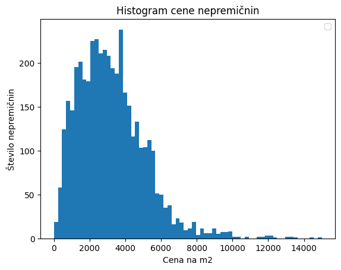
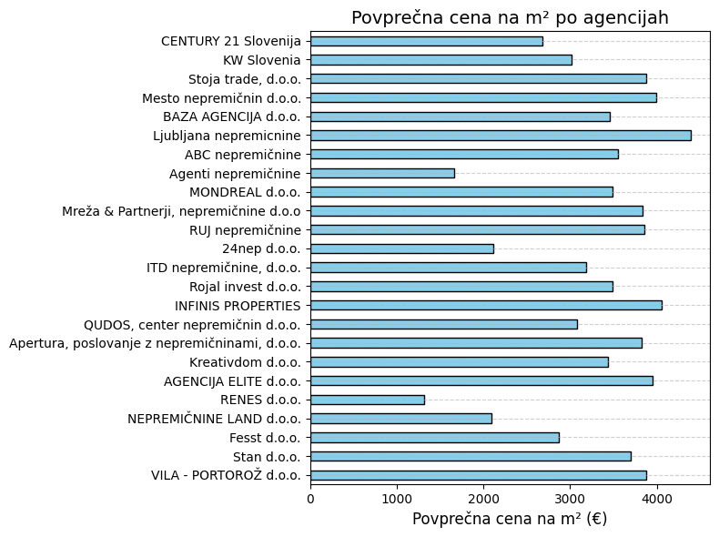

# It's FRI real estate

## Uvod

TODO vprašanja

## Zajemanje podatkov

Podatke smo zajemali iz spletnih strani `nepremicnine.net`, `mojikvadrati.com` in `bolha.com`.

`nepremicnine.net` imajo spletno zaščito pred roboti s strani Cloudflare. Za obhod te zaščite smo uporabili knjižnico `hrequests`. Podatke smo dobili iz HTML-ja strani, saj nima ustreznega odprtega API-ja. Veliko pomembnih informacij je tukaj navedenih v opisu, zaradi česar jih je težko izluščiti. Za izluščanje podatkov iz opsia smo mislili uporabiti LLM, ampak je bilo preveč vrstic, da bi v normalnem času sprocesiral vso besedilo. Za branje podatkov iz HTML strukture smo uporabili knjižnico `BeautifulSoup`. Vnosovov na `nepremicnine.net` je ogromno (nad 60000). Da smo vse podatke izluščili v dovolj kratkem času, smo prošnje paralelizirali.

Za `mojikvadrati.com` smo prav tako podatke dobili iz HTML, ampak tu so veliko bolje strukturirani. Pomembni podatkih so lepo napisani v naslovih in seznamih. Na tej podatkovni zbirki smo vnosom dodali še podatke o koordinatah. Za to smo uporabili knjižnico `geopy`. Koordinate smo dobili iz kraja v katerem je nepremičnina. Včasih pa je skripta izbrala napačne koordinate, ko obstajajo kraji z enakimi imeni v drugih državah. Te napake smo zaenkrat zanemarili, ker jih je težko odkriti.

Podatke smo zbrali v `csv` datotekah.

## Vizualizacije

Za branj podatkov v Pythonu smo uporabili `pandas` knjižnico, grafe pa smo risali z `matplotlib` in `seaborn`. Za risanje podatkov na zemljevidu smo uporabili `cartopy` knjižnico.

### Risanje cen

Za začetek smo pogledali kako se cene odražajo na zemljevidu. Na `mojikvadrati.net` je bila večina cen napisana kot cena za celotno nepremičnino, zato smo to najprej pretvorili v ceno na kvadratni meter. Kljub temu se še vedno najdejo oglaševalci, ki dajo svojim oglasom napačne enote za cene.

Poglejmo si najprej zemljevid, kjer so prikazane vse cene hiš in stanovanj skupaj s ceno.


Vidimo, da se pojavijo območja, kjer je veliko dragih nepremičnin, kot sta Ljubljana in obala. Nekaj dragih nepremičnin se pojavi še v krajih, od koder se ljudje pogosto vozijo v Ljubljano, kot so Kranj, Domžale in Grosuplje. Drage nepremičnine se pojavijo še v Jesenicah, Kranjski gori in Gorici. Zanimimvo je, da je v okolici Maribora in v Savinjski regiji na voljo veliko nepremičnin. Ki pa so relativno poceni.

Nato smo cene za stanovanja in hiše narisali na histogramu, da smo dobili porazdelitev in iz tega določili mejo za osamelce. Pri tem smo omejili ceno na 15.000 EUR/m2, da se izognemo napačno vnešenim podatkom.

```Python
hs_df = hs_df[hs_df["cena_na_m2"] <= 15000]
plt.figure()
plt.hist(hs_df["cena_na_m2"], bins="sqrt")
plt.title('Histogram cene nepremičnin')
plt.xlabel('Cena na m2')
plt.ylabel('Število nepremičnin')
plt.legend();   
```



Cena sledi približno Beta porazdelitvi.

```Python
pars_b = beta.fit(cena_na_m2)
xb = np.linspace(cena_na_m2.min(), cena_na_m2.max(), 1000)
B_fit = [beta.pdf(x, *pars_b) for x in xb]
```


Če vzamemo stopnjo značilnosti za osamelce $\alpha = 0,05$, dobimo, da so nenavadno poceni nepremičnine pod 540 EUR/m2, nenavadno drage pa nad 7780 EUR/m2. Pod osamelce na spodnji strani spadajo razne napol podrte in zapuščene hiše, na zgornji pa luksuzni penthousi v Ljubljani, obali in tujini. Posebej izstopa Ljubljanski Schellenburg.

Pri `nepremicnine.net` ni podane enote za ceno, ampak večina jih navaja ceno za celo nepremičnino. Da ignoriramo vrednosti, ki očitno niso pravilne, smo se omejili med 50.000 in 100.000.000 EUR.

### Risanje starosti

Nadaljevali smo s histogramom leta gradnje. Pri tem smo ugotovili, da je izmed vseh oglasov okoli 22% novogradenj, nepremičnine, zgrajene pred letom 2023 pa so približno enakomerno porazdeljene.


### Risanje ponudnikov

Pogledali smo, kolikšen delež nepremičninskega trga zaseda posamezna agencija in katera ima najboljše ponudbe v povprečju.




Vidimo, da največji delež zaseda CENTURY 21 agencija, ogromno pa je majhnih agencij, ki spadajo pod "ostalo". Povprečna cena je največja pri agenciji Ljubljana nepremičnine, najcenejša pa pri RENES d.o.o., ki se ukvarja večino s prodajo zanemarjenih hiš.