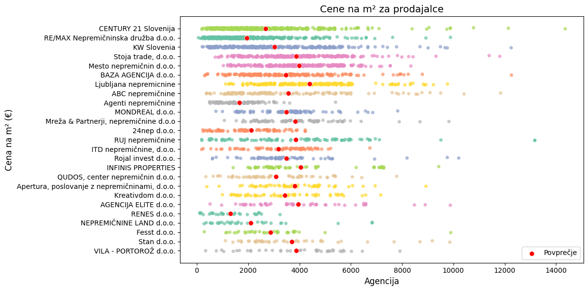

# Ko kvadratni metri spregovorijo – ali so slovenske nepremičnine "kuhane"?​

## Uvod

Do vmesnega poročila smo zbrali vse ustrezne podatke in jih predstavili z raznimi vizualizacijami statistik. Z vizualizacijami smo tudi pogledali kako različni atributi vplivajo na ceno nepremičnin.

## Zajemanje podatkov

Podatke smo zajemali iz spletnih strani `nepremicnine.net`, `mojikvadrati.com` in `bolha.com`.

Za obhod raznih zaščit strani pred roboti smo uporabili knjižnico `hrequests`. Podatke smo dobili iz HTML-ja strani, saj nima ustreznega odprtega API-ja. Veliko pomembnih informacij je tukaj navedenih v opisu, zaradi česar jih je težko izluščiti. Za branje podatkov iz HTML strukture smo uporabili knjižnico `BeautifulSoup`. Vnosovov na `nepremicnine.net` je ogromno (nad 60000). Da smo vse podatke izluščili v dovolj kratkem času, smo prošnje paralelizirali.

Za `mojikvadrati.com` smo prav tako podatke dobili iz HTML, ampak tu so veliko bolje strukturirani. Na tej podatkovni zbirki smo vnosom dodali še podatke o koordinatah. Za to smo uporabili knjižnico `geopy`. Koordinate smo dobili iz naslovov oglasov, vendar zaradi narave podatkov včasih koordinate niso točne.

Podatke smo zbrali v `csv` datotekah.

## Vizualizacije

Za branj podatkov v Pythonu smo uporabili `pandas` knjižnico, grafe pa smo risali z `matplotlib` in `seaborn`. Za risanje podatkov na zemljevidu smo uporabili `cartopy` knjižnico.

### Splošni pogled na cene

Za začetek smo pogledali kako se cene odražajo na zemljevidu.

Poglejmo si najprej zemljevid, kjer so prikazane vse cene hiš in stanovanj skupaj s ceno.


Vidimo, da se pojavijo območja, kjer je veliko dragih nepremičnin, kot sta Ljubljana in obala. Nekaj dragih nepremičnin se pojavi še v krajih, od koder se ljudje pogosto vozijo v Ljubljano, kot so Kranj, Domžale in Grosuplje. Drage nepremičnine se pojavijo še v Jesenicah, Kranjski gori in Gorici. Zanimimvo je, da je v okolici Maribora in v Savinjski regiji na voljo veliko nepremičnin, ki pa so relativno poceni.

Nato smo cene za stanovanja in hiše narisali na histogramu, da smo dobili porazdelitev in iz tega določili mejo za osamelce.

Cena sledi približno Beta porazdelitvi.

```Python
pars_b = beta.fit(cena_na_m2)
xb = np.linspace(cena_na_m2.min(), cena_na_m2.max(), 1000)
B_fit = [beta.pdf(x, *pars_b) for x in xb]
```


Če vzamemo stopnjo značilnosti za osamelce $\alpha = 0,05$, dobimo, da so nenavadno poceni nepremičnine pod 540 EUR/m2, nenavadno drage pa nad 7780 EUR/m2. Pod osamelce na spodnji strani spadajo razne napol podrte in zapuščene hiše, na zgornji pa luksuzni penthousi v Ljubljani, obali in tujini. Posebej izstopa Ljubljanski Schellenburg.

Pri `nepremicnine.net` ni podane enote za ceno, ampak večina jih navaja ceno za celo nepremičnino. Da ignoriramo vrednosti, ki očitno niso pravilne, smo se omejili med 50.000 in 100.000.000 EUR.

### Starost nepremičnin

Nadaljevali smo s histogramom leta gradnje. Pri tem smo ugotovili, da je izmed vseh oglasov okoli 22% novogradenj, nepremičnine, zgrajene pred letom 2023 pa so približno enakomerno porazdeljene.


### Nepremičninske agencije

Pogledali smo, kolikšen delež nepremičninskega trga zaseda posamezna agencija in katera ima najboljše ponudbe v povprečju.




Vidimo, da največji delež zaseda CENTURY 21 agencija, ogromno pa je majhnih agencij, ki spadajo pod "ostalo". Povprečna cena je največja pri agenciji Ljubljana nepremičnine, najcenejša pa pri RENES d.o.o., ki se ukvarja večino s prodajo zanemarjenih hiš.

### Povezava starosti z izbranimi atributi

Da smo preverili, ali starost gradnje vpliva na ceno, smo narisali scatter plot in preverili Pearsonov koeficient.


Vidimo, da ima starost gradnje nizko stopnjo korelacije s ceno. To nam pove tudi nizek Pearsonov koeficient (0,17). Stare hiše so namreč pogosto adaptirane, zaradi česar jim vrednost ne pada. Je pa povprečna cena na kvadratni meter nepremičnin zgrajenih po letu 2020 kar za 23% višja od povprečne cene ostalih nepremičnin.

Kot pričakovano, so novogradnje poleg višje cene tudi bolj energetsko učinkovite. Iz tega sledi, da je tudi med ceno in energetsko učinkovitostjo korelacija, čeprav dokaj nizke stopnje.


### Zemljevid novogradenj

Odgovor na vprašanje kje je največ novogradenj smo spet dobili na zemljevidu.


Vidimo, da je ta mapa zelo podobna mapi dragih nepremičnin. Večina novogradenj je v večjih slovenskih mestih, prav tako pa jih je kar nekaj blizu meje na hrvaški obali.

### Cena v odvnisnosti od demografskih atributov

Pogledali smo, kako se cena na kvadratni meter spreminja z regijo in njenimi podatki o prebivalstvu.


Na prvem zemljevidu lahko vidimo, da največje razmerje med povprečno ceno stanovanja in številom prebivalcev pripada Obalno-kraški regiji. To je predvidoma res, zaradi velikega števila počitniških hiš, katerih prebivalci nimajo stalnega naslova v tej regiji. Prav tako pa je presenetljivo, da je regija, ki vsebuje Ljubljano - osrednjeslovenska regija - zelo nizko uvrščena. Do tega pride zaradi velikega števila prebivalcev. Nekakšen popravek tega lahko vidimo na naslednjem zemljevidu, ki prikazuje razmerje med povprečno ceno stanovanja in povprečno neto plačo prebivalcev te regije. Na nek način prikaže, koliko mesecev bi prebivalec neke regije moral delati, da bi si lahko privoščil povprečno stanovanje/hišo, brez da upoštevamo druge mesečne stroške. Na tem zemljevidu je osrednjeslovenska regija druga po vrsti, kar ni presenetljivo.

Kot demografski atribut smo pogledali še, če je na voljo več nepremičnin v regijah, kjer je več ločitev. Novo ločeni ljudje namreč običajno rabijo tudi novo nepremičnino.


V Obalno-kraški ločitve najverjetneje nimajo vpliva na število nepremičnin, ker je regija bolj turistično nagnjena. Lahko bi sklepali, da pa v regijah na koncu grafa, torej Zasavska, Koroška, Posavska in Savinjska, verjetno vidita dodatno nepremičnino za vsako ločitev.

### Čas za adaptacijo nepremičnin


Vidimo, da je večina nepremičnin bila obnovljena v ~100 do 200 letih izgradnje, vendar se pa število zmanjša pri okoli ~500 letih. To so večinoma "rustične nepremičnine" v naravi, gradovi ...

### Vikendi


Italija je za vikende najdražja, ima pa le okoli 40 nepremičnin naprodaj. Hrvaška jih ima več, okoli 400. Avstrija je najcenejša, ampak je podatek iz le ene nepremičnine. Ostale države po Evropi večinoma nimajo nič naprodaj, ali pa so v isti situaciji kot Avstrija.