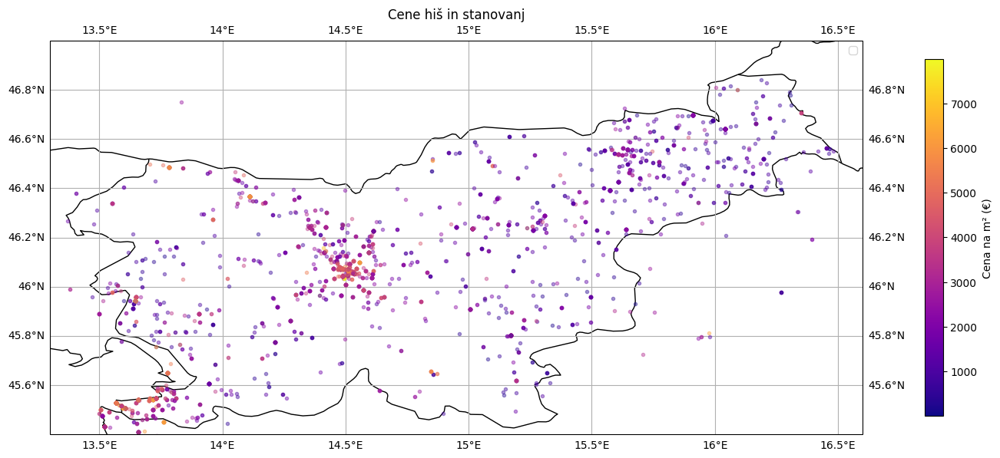

## Zajemanje podatkov

Za obhod raznih zaščit strani pred roboti smo uporabili knjižnico `hrequests`. Podatke smo dobili iz HTML-ja strani, saj nobena stran nima ustreznega odprtega vmesnika. Za branje podatkov iz HTML strukture smo uporabili knjižnico `BeautifulSoup`.

Vnosom iz zbirke strani `mojikvadrati.com` smo dodali še podatke o koordinatah. Za to smo uporabili knjižnico `geopy`. Koordinate smo dobili iz naslovov oglasov, vendar zaradi narave podatkov včasih koordinate niso točne.

## Vizualizacije

Za branje podatkov v Pythonu smo uporabili `pandas` knjižnico, grafe pa smo risali z `matplotlib` in `seaborn`. Za risanje podatkov na zemljevidu smo uporabili `cartopy` in `geopandas` knjižnici.

### Nepremičninske agencije

 Najmanjša odstopanja od napovednega modela oz. pričakovanih cen imajo agencije Bamba nepremičnine, BCAKTIV in INVESTMOND.

### Cena v odvnisnosti od demografskih atributov

Spodaj je prikazan zemljevid, kjer so narisane vse cene hiš in stanovanj.

Vidimo, da se pojavijo območja, kjer je veliko dragih nepremičnin, kot sta Ljubljana in Obala. Nekaj dragih nepremičnin se pojavi še v krajih, od koder se ljudje pogosto vozijo v Ljubljano, kot so Kranj, Domžale in Grosuplje. Drage nepremičnine se pojavijo še v Jesenicah, Kranjski gori in Novi Gorici. Zanimivo je, da je v okolici Maribora in v Savinjski regiji na voljo veliko nepremičnin, ki pa so relativno poceni.

Kot demografski atribut smo pogledali še, če je na voljo več nepremičnin v regijah, kjer je več ločitev. Novo ločeni ljudje namreč običajno rabijo tudi novo nepremičnino. Bistvene povezave med številom ločitev in številom oglasov ni.

### Napoved cene iz slik

Pri učenju so nam veliko težav povzročile fotografije, ki slabo predstavijo nepremičnino, npr. ko je namesto hiše slikan bližnji gozd. Take fotografije smo deloma počistili z ročnim pregledom. Za učenje modela nam je ostalo okoli 44.000 fotografij. Model smo testirali na 1.000 fotografijah oglasov, ki so bili objavljeni po prvotnem zbiranju oglasov.

### Izvorna koda

Za ogled izvorne kode si ne pozabite ogledati vseh vej.